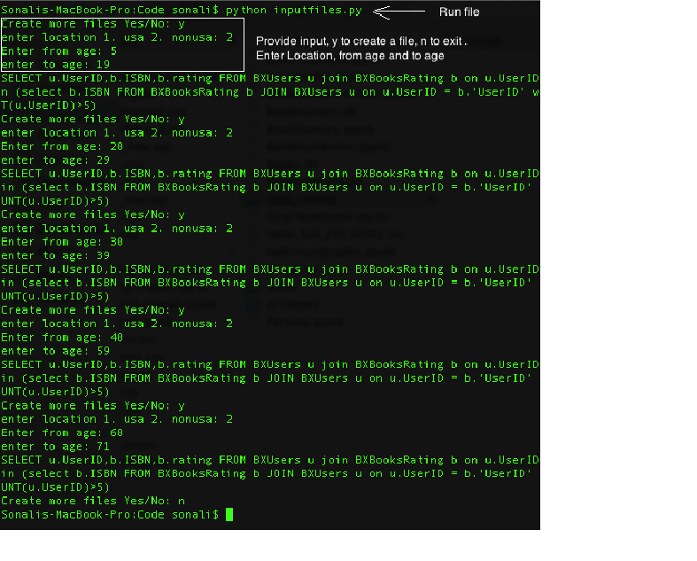
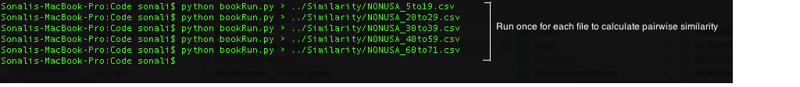

This file contains instructions to run the code.

## Recommendations

### **user.py**

This module is used to provide user recommendations.This is the only module that needs to be run to provide recommendations.
The user is asked to enter his/her name, age and location. Based on location and age, the application selects 5 relevant books
from the database and asks the user to rate them. The books which have been given a rating of 5 and above are the considered.
user.py in turn calls another mrjob Recommend.py and passes two input to it:
* List of books that have been given a rating of 5 and above.
* Name of the file that had precalculated pairwise book rating. The file is based on the age and location information entered by the user.

Output

The output is the recommendation file which is in txt format. This file is stored in Recommendations folder and is named as recommendation_ < name_of_the_user >.txt
The file contains names of 5 recommended books along with the author name and the year of publication.

Steps to run:

Before running user.py, replace the filepath in Recommend.py with the absolute path of the database. The database Books.db
is stored under Database folder. 

After making the filepath change run user.py as shown below

### **Recommend.py**

This module is used to calculate the top 5 recommended books. This does not need to be run separately, it is called by user.py module
This is an mrjob that takes a list of books as the name of the similarity file. It then find books similar to the ones
rated by the user by reading the similarity file. The returned list of books are arranged in descending order of similarity and top
5 books are returned as recommendation to the user.

## Pre- Recommendation steps:

Before providing recommendation relevant files have to be prepared and pairwise boom similarty has to be calculated for
each location(USA/NON-USA) and age groups and stored in separate files.

### **inputfiles.py**

This module is used to create input files which are then used by the mrjob to compute and store pair wise similarity 
between books. This module is run only once by the administrator in the beginning to prepare data and should not be run again for 
providing recommendations.
The input provided is the location and the age groups for which the records have to be taken. The data is read from sqlite3
database. The program reads userid, book isbn and rating for the specified age group and location. Filter in the query are:
* Take books for the specified age range(from age/toage) and location (USA/ NON-USA)
* Take books which have been rated by atleast five users
* Take books which have a rating of greater than 0

Output

The output file is in csv format and is stored automatically in the Data folder with the name USA_< toage >to< fromage >.csv or NONUSA_< toage >to< fromage >.csv
For this project the following age groups were taken for both USA and NON-USA locations (total 10 files are created):
* 5 to 19
* 20 to 29
* 30 to 39
* 40 to 59
* 60 to 71

Steps to run:

### **bookCollaborativeFiltering.py**
This module is used to calculate pairwise similaroty between books for each location and age group. This is an mrjob that
takes the name of the file as an input and dumps the output file in the similarity folder. To run this job use the runner
bookRun.py as described in the step below.

Output

The output file is in csv format and consists of pair wise similarity of books. Separate files are created and each corresponds to the files 
created in the step above (inputfiles.py)

Steps to run:
This is run using the runner module bookRun.py as described below:

### **bookRun.py**
This is the runner and is used to run the mrjob and output the results in desired format. 

Output
The output file is in csv format and consists of pair wise similarity of books. Separate files are created and each corresponds to the files 
created in the step above (inputfiles.py)

Steps to run:

* Run this module for every file in the data folder. First change the input file in bookRun.py

* Provide the output file name (same as the input file, but in the Similarity folder)

